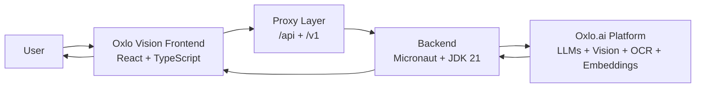

<h1 align="center">Oxlo Vision</h1>

  <strong>Hackathon project built for OxBuild by Oxlo.ai</strong>

  
  

<h2 align="center">🚀 Judges: Try the deployed project here</h2>

  <a href="https://oxlovision.vercel.app/"><strong>https://oxlovision.vercel.app/</strong></a>

---

## Judges First

Oxlo Vision was built to demonstrate a complete, real-world AI workflow in one product:

- Input: upload digital or scanned PDFs
- Processing: extract text + OCR fallback
- Intelligence: orchestrate Oxlo.ai models through a unified backend
- Output: summaries, key points, mind maps, concept maps, markdown, and diagrams

For judging, the fastest validation path is to test the live product directly:

## https://oxlovision.vercel.app/

---

## Why Oxlo Vision
Oxlo Vision transforms PDF documents into actionable knowledge for students, researchers, and developers:

- Extracts text from standard PDFs and scanned PDFs (OCR fallback)
- Generates concise summaries and key points
- Builds mind maps and concept maps from real extracted content
- Produces markdown and AI-ready skill outputs for developer workflows
- Supports chat-based exploration over uploaded document content

## Built For OxBuild Judges
This project is designed to demonstrate practical value, technical execution, and product readiness:

- Fast end-to-end experience: upload PDF -> extract -> analyze -> visualize
- Real AI orchestration through Oxlo.ai model ecosystem
- Clear developer-focused outputs (markdown, diagrams, skills)
- Production-style deployment and API proxy strategy

## Tech Stack

## Architecture Snapshot

## Core Features
- PDF upload with drag-and-drop and file selector
- Text extraction with OCR support for scanned pages
- Document summary and key-point generation
- Mind map generation from extracted document semantics
- Concept map generation for structured understanding
- AI chat over uploaded document context
- Diagram generation support for technical documentation

## Judge Quick Checklist
- Product value: solves a real information extraction bottleneck
- AI integration depth: multiple Oxlo.ai capabilities in one flow
- Developer usefulness: exports and structures ready for AI-assisted coding workflows
- UX completeness: from raw PDF to insights in one interface
- Deployment readiness: publicly available and testable now

## Live Project
### https://oxlovision.vercel.app/

If you are evaluating Oxlo Vision, please start with the live demo above.

## Licenses

- Frontend: [MIT](../../front-end/LICENSE)
- Backend: [MIT](../../back-end/LICENSE)
